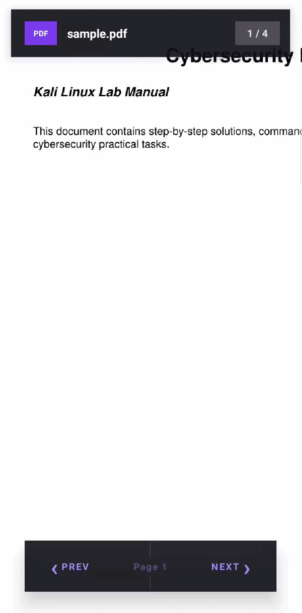

## PdfViewerLibrary
[](https://kotlinlang.org/)
[](LICENSE)
[](#)

A professional, lightweight Android PDF viewer library built on top of the MuPDF engine. Supports smooth rendering, pinch-to-zoom, and — most importantly — native text selection with copy/paste, just like Adobe Acrobat and Google Drive.

---

### Features

- Smooth PDF Rendering — powered by MuPDF, one of the fastest PDF engines available
- Pinch to Zoom — fluid zoom in/out with ScaleGestureDetector
- Text Selection — long press to start, drag to select, handles appear at start/end
- Copy & Paste — selected text preserves original spacing, word gaps, and line breaks
- Fully Customizable UI — highlight color, popup background, text color, handle color, all configurable
- Multi-page Support — navigate forward/backward through pages

---

### Preview



---

## Installation

### Step 1: Add JitPack

```gradle
dependencyResolutionManagement {
    repositories {
        google()
        mavenCentral()
        maven { url 'https://jitpack.io' }
        maven { url = uri("https://maven.ghostscript.com") }
    }
}
```

### Step 2: Add Dependency

```gradle
dependencies {
	        implementation 'com.github.Excelsior-Technologies-Community:Android_PdfViewerLib:1.0.0'
	}
```

### Step 3 : Add Add packaging options

```gradle
android {
    packaging {
        jniLibs {
            useLegacyPackaging = true // Required for MuPDF .so files
        }
    }
}
```

---

### Basic Usage

1. Add to your layout
```xml
<com.ext.pdfviewer.PdfViewerView
    android:id="@+id/pdfViewer"
    android:layout_width="match_parent"
    android:layout_height="match_parent" />
```

2. Load a PDF
```kotlin
val pdfViewer = findViewById<PdfViewerView>(R.id.pdfViewer)
val file = File(filesDir, "document.pdf")

pdfViewer.loadPdf(file)
```

3. Page Navigation
```kotlin
// Go to next page
pdfViewer.nextPage()

// Go to previous page
pdfViewer.previousPage()

// Get current page index (0-based)
val page = pdfViewer.getCurrentPage()

// Get total page count
val total = pdfViewer.getPageCount()
```

---


### PDF Viewer Configuration

| Parameter                 | Type    | Default Value                          | Description |
|--------------------------|--------|----------------------------------------|-------------|
| `enableCopyText`         | Boolean | `true`                                 | Enable/disable text selection and copy |
| `enableZoom`             | Boolean | `true`                                 | Enable/disable pinch-to-zoom |
| `highlightColor`         | Int     | `argb(100,255,213,0)` (Yellow)         | Color of selected text highlight |
| `popupBackgroundColor`   | Int     | `Color.WHITE`                          | Background color of the copy popup |
| `popupTextColor`         | Int     | `Color.BLACK`                          | Text/icon color in the copy popup |
| `selectionHandleColor`   | Int     | Material Blue                          | Color of the circular drag handles |
| `selectionBorderColor`   | Int     | Material Blue                          | Color of dashed selection border while dragging |
| `selectionUnderlineColor`| Int     | Material Blue                          | Underline color beneath selected characters |

### Runtime Theme Switching

```kotlin
// Switch to dark theme
pdfViewer.updateConfig(PdfConfig(
    highlightColor       = Color.argb(120, 255, 165, 0),   // orange highlight
    popupBackgroundColor = Color.parseColor("#1E1E1E"),      // dark background
    popupTextColor       = Color.WHITE,
    selectionHandleColor = Color.parseColor("#BB86FC")       // purple handles
))

// Switch back to light theme
pdfViewer.updateConfig(PdfConfig(
    highlightColor       = Color.argb(100, 255, 213, 0),
    popupBackgroundColor = Color.WHITE,
    popupTextColor       = Color.BLACK
))
```

---

### Listening to Events

```kotlin
pdfViewer.onTextCopied = { copiedText ->
    Log.d("PDF", "User copied: $copiedText")
    // Save to history, analytics, etc.
}
```

When set, a Search button appears in the copy popup alongside Copy:
```kotlin
pdfViewer.onSearchListener = { selectedText ->
    // Open browser, in-app search, dictionary, etc.
    val intent = Intent(Intent.ACTION_WEB_SEARCH).apply {
        putExtra(SearchManager.QUERY, selectedText)
    }
    startActivity(intent)
}
```

### Loading PDFs from Different Sources

From Assets folder
```kotlin
private fun copyFromAssets(fileName: String): File {
    val file = File(filesDir, fileName)
    if (!file.exists()) {
        assets.open(fileName).use { input ->
            file.outputStream().use { output ->
                input.copyTo(output)
            }
        }
    }
    return file
}

// Usage
pdfViewer.loadPdf(copyFromAssets("sample.pdf"))
```

From Downloads / File Picker
```kotlin
// In your Activity result handler
val uri = result.data?.data ?: return
val file = copyUriToFile(uri)
pdfViewer.loadPdf(file)

private fun copyUriToFile(uri: Uri): File {
    val file = File(cacheDir, "picked.pdf")
    contentResolver.openInputStream(uri)?.use { input ->
        file.outputStream().use { output ->
            input.copyTo(output)
        }
    }
    return file
}
```

---

### Example Usage

**XML Usage**
```xml
<?xml version="1.0" encoding="utf-8"?>
<androidx.coordinatorlayout.widget.CoordinatorLayout
    xmlns:android="http://schemas.android.com/apk/res/android"
    xmlns:tools="http://schemas.android.com/tools"
    android:id="@+id/main"
    android:layout_width="match_parent"
    android:layout_height="match_parent"
    android:background="#0F0F13"
    tools:context=".MainActivity">

    <!-- PDF Viewer — full screen behind floating bars -->
    <com.ext.pdfviewer.PdfViewerView
        android:id="@+id/pdfViewer"
        android:layout_width="match_parent"
        android:layout_height="match_parent"
        android:background="#F5F5F0" />

    <!-- Top Bar — floating semi-transparent dark bar -->
    <LinearLayout
        android:id="@+id/topBar"
        android:layout_width="match_parent"
        android:layout_height="56dp"
        android:layout_gravity="top"
        android:layout_marginStart="16dp"
        android:layout_marginTop="12dp"
        android:layout_marginEnd="16dp"
        android:background="#E6111118"
        android:elevation="10dp"
        android:gravity="center_vertical"
        android:orientation="horizontal"
        android:paddingStart="16dp"
        android:paddingEnd="12dp">

        <!-- Purple PDF badge — no drawable needed, solid color bg -->
        <TextView
            android:layout_width="38dp"
            android:layout_height="28dp"
            android:background="#7C3AED"
            android:gravity="center"
            android:text="PDF"
            android:textColor="#FFFFFF"
            android:textSize="9sp"
            android:textStyle="bold" />

        <!-- File name -->
        <TextView
            android:id="@+id/tvFileName"
            android:layout_width="0dp"
            android:layout_height="wrap_content"
            android:layout_weight="1"
            android:layout_marginStart="12dp"
            android:ellipsize="end"
            android:maxLines="1"
            android:text="document.pdf"
            android:textColor="#FFFFFFFF"
            android:textSize="14sp"
            android:textStyle="bold" />

        <!-- Page count chip — white tinted bg -->
        <TextView
            android:id="@+id/tvPageCount"
            android:layout_width="wrap_content"
            android:layout_height="28dp"
            android:background="#33FFFFFF"
            android:gravity="center"
            android:paddingStart="14dp"
            android:paddingEnd="14dp"
            android:text="1 / 1"
            android:textColor="#CCFFFFFF"
            android:textSize="12sp"
            android:textStyle="bold" />

    </LinearLayout>

    <!-- Bottom Navigation Bar — floating dark pill -->
    <LinearLayout
        android:layout_width="match_parent"
        android:layout_height="60dp"
        android:layout_gravity="bottom"
        android:layout_marginStart="32dp"
        android:layout_marginEnd="32dp"
        android:layout_marginBottom="32dp"
        android:background="#E6111118"
        android:elevation="16dp"
        android:gravity="center_vertical"
        android:orientation="horizontal"
        android:paddingStart="6dp"
        android:paddingEnd="6dp">

        <!-- Previous Button -->
        <LinearLayout
            android:id="@+id/btnPrev"
            android:layout_width="0dp"
            android:layout_height="match_parent"
            android:layout_weight="1"
            android:clickable="true"
            android:focusable="true"
            android:gravity="center"
            android:orientation="horizontal">

            <TextView
                android:layout_width="wrap_content"
                android:layout_height="wrap_content"
                android:text="&#8249;"
                android:textColor="#A78BFA"
                android:textSize="28sp"
                android:textStyle="bold" />

            <TextView
                android:layout_width="wrap_content"
                android:layout_height="wrap_content"
                android:layout_marginStart="4dp"
                android:text="PREV"
                android:textColor="#A78BFA"
                android:textSize="11sp"
                android:textStyle="bold"
                android:letterSpacing="0.12" />

        </LinearLayout>

        <!-- Center page label -->
        <LinearLayout
            android:layout_width="0dp"
            android:layout_height="match_parent"
            android:layout_weight="1"
            android:gravity="center"
            android:orientation="vertical">

            <!-- Top thin accent line -->
            <View
                android:layout_width="1dp"
                android:layout_height="16dp"
                android:background="#33A78BFA" />

            <TextView
                android:id="@+id/tvPageIndicator"
                android:layout_width="wrap_content"
                android:layout_height="wrap_content"
                android:layout_marginTop="4dp"
                android:layout_marginBottom="4dp"
                android:text="Page 1"
                android:textColor="#66A78BFA"
                android:textSize="11sp"
                android:textStyle="bold"
                android:letterSpacing="0.08" />

            <!-- Bottom thin accent line -->
            <View
                android:layout_width="1dp"
                android:layout_height="16dp"
                android:background="#33A78BFA" />

        </LinearLayout>

        <!-- Next Button -->
        <LinearLayout
            android:id="@+id/btnNext"
            android:layout_width="0dp"
            android:layout_height="match_parent"
            android:layout_weight="1"
            android:clickable="true"
            android:focusable="true"
            android:gravity="center"
            android:orientation="horizontal">

            <TextView
                android:layout_width="wrap_content"
                android:layout_height="wrap_content"
                android:layout_marginEnd="4dp"
                android:text="NEXT"
                android:textColor="#A78BFA"
                android:textSize="11sp"
                android:textStyle="bold"
                android:letterSpacing="0.12" />

            <TextView
                android:layout_width="wrap_content"
                android:layout_height="wrap_content"
                android:text="&#8250;"
                android:textColor="#A78BFA"
                android:textSize="28sp"
                android:textStyle="bold" />

        </LinearLayout>

    </LinearLayout>

</androidx.coordinatorlayout.widget.CoordinatorLayout>
```

**Kotlin Usage**
```kotlin
import android.graphics.Color
import android.os.Bundle
import android.widget.LinearLayout
import android.widget.TextView
import androidx.activity.enableEdgeToEdge
import androidx.appcompat.app.AppCompatActivity
import androidx.core.view.ViewCompat
import androidx.core.view.WindowInsetsCompat
import com.ext.pdfviewer.PdfConfig
import com.ext.pdfviewer.PdfViewerView
import java.io.File

class MainActivity : AppCompatActivity() {
    private lateinit var pdfViewer: PdfViewerView
    private lateinit var btnNext: LinearLayout
    private lateinit var btnPrev: LinearLayout
    private lateinit var tvPageCount: TextView
    private lateinit var tvPageIndicator: TextView
    private lateinit var tvFileName: TextView
    override fun onCreate(savedInstanceState: Bundle?) {
        super.onCreate(savedInstanceState)
        enableEdgeToEdge()
        setContentView(R.layout.activity_main)
        ViewCompat.setOnApplyWindowInsetsListener(findViewById(R.id.main)) { v, insets ->
            val systemBars = insets.getInsets(WindowInsetsCompat.Type.systemBars())
            v.setPadding(systemBars.left, systemBars.top, systemBars.right, systemBars.bottom)
            insets
        }
        pdfViewer       = findViewById(R.id.pdfViewer)
        btnNext         = findViewById(R.id.btnNext)
        btnPrev         = findViewById(R.id.btnPrev)
        tvPageCount     = findViewById(R.id.tvPageCount)
        tvPageIndicator = findViewById(R.id.tvPageIndicator)
        tvFileName      = findViewById(R.id.tvFileName)

        // Copy sample.pdf from assets to file storage
        val file = getPdfFile()
        tvFileName.text = file.name

        // ✅ Load with config
        pdfViewer.loadPdf(file, PdfConfig(
            enableCopyText          = true,
            enableZoom              = true,
            highlightColor          = Color.argb(110, 167, 139, 250),
            popupBackgroundColor    = Color.parseColor("#1E1E2A"),
            popupTextColor          = Color.parseColor("#E8D5FF"),
            selectionHandleColor    = Color.parseColor("#7C3AED"),
            selectionBorderColor    = Color.argb(160, 124, 58, 237),
            selectionUnderlineColor = Color.argb(160, 124, 58, 237)
        ))

        updatePageUI()

        btnNext.setOnClickListener {
            pdfViewer.nextPage()
            updatePageUI()
        }

        btnPrev.setOnClickListener {
            pdfViewer.previousPage()
            updatePageUI()
        }

        pdfViewer.onTextCopied = { _ -> }
    }

    private fun updatePageUI() {
        val current = pdfViewer.getCurrentPage() + 1
        val total   = pdfViewer.getPageCount().takeIf { it > 0 } ?: 1
        tvPageCount.text     = "$current / $total"
        tvPageIndicator.text = "Page $current"
    }

    private fun getPdfFile(): File {
        val file = File(filesDir, "sample.pdf")
        if (!file.exists()) {
            assets.open("sample.pdf").use { input ->
                file.outputStream().use { output ->
                    input.copyTo(output)
                }
            }
        }
        return file
    }
}
```

---

### License

```
MIT License

Copyright (c) 2025 Excelsior Technologies 

Permission is hereby granted, free of charge, to any person obtaining a copy
of this software and associated documentation files (the "Software"), to deal
in the Software without restriction, including without limitation the rights
to use, copy, modify, merge, publish, distribute, sublicense, and/or sell
copies of the Software, and to permit persons to whom the Software is
furnished to do so, subject to the following conditions:

The above copyright notice and this permission notice shall be included in all
copies or substantial portions of the Software.

THE SOFTWARE IS PROVIDED "AS IS", WITHOUT WARRANTY OF ANY KIND, EXPRESS OR
IMPLIED, INCLUDING BUT NOT LIMITED TO THE WARRANTIES OF MERCHANTABILITY,
FITNESS FOR A PARTICULAR PURPOSE AND NONINFRINGEMENT. IN NO EVENT SHALL THE
AUTHORS OR COPYRIGHT HOLDERS BE LIABLE FOR ANY CLAIM, DAMAGES OR OTHER
LIABILITY, WHETHER IN AN ACTION OF CONTRACT, TORT OR OTHERWISE, ARISING FROM,
OUT OF OR IN CONNECTION WITH THE SOFTWARE OR THE USE OR OTHER DEALINGS IN THE
SOFTWARE.
```
